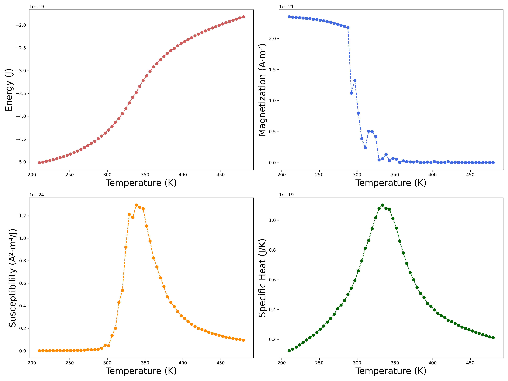

# Ising Model Simulation with External Field

This project simulates the two-dimensional Ising model in the presence of an external magnetic field. It provides a computational study of magnetic phase transitions in a ferromagnetic system using the Metropolis Monte Carlo method. All parameters are expressed in physical units (Kelvin, Tesla, Joules, etc.) to allow comparison with experimental systems.

## Physical Model

The Ising model represents a magnetic material as a grid of discrete spins $S_i = \pm 1$, where each spin interacts with its nearest neighbors and may also couple to an external magnetic field.

### Hamiltonian

The total energy (Hamiltonian) of the system is:

$$
H(S_i) = -J \sum_{\langle i,j \rangle} S_i S_j - \mu h \sum_i S_i
$$

- $J$ — Spin-spin coupling energy [Joules]. A positive $J$ corresponds to ferromagnetic interactions.
- $\mu$ — Magnetic moment per spin [J/T], e.g., Bohr magneton $\mu_B \approx 9.27 \times 10^{-24} \, \text{J/T}$.
- $h$ — External magnetic field [Tesla].
- $\langle i,j \rangle$ — Nearest-neighbor spin pairs.

## Visualization

### Spin Grid Evolution

Below is an example of the spin configuration evolution during the simulation for 100x100 spin grid:


### Temperature-Dependent Physical Quantities

The phase transition behavior becomes clear when examining these thermodynamic quantities calculated across different temperatures even at smaller grid sizes (In this calculation the grid size was 16x16, but also the finite size effects somewhat distorts the characteristics of the plots):



*From left to right:*
1. **Magnetization vs Temperature** - Shows the phase transition at Tc
2. **Magnetic Susceptibility** - Diverges at the critical temperature
3. **Heat Capacity** - Peaks at the phase transition
4. **Energy per Spin** - Shows discontinuity at Tc

## Thermodynamic Quantities

### Magnetization

The magnetization $M$ is the net magnetic moment:

$$
M = \mu \sum_i S_i
$$

Its average $\langle M \rangle$ is computed over many Monte Carlo steps after thermal equilibration.

### Energy

The total internal energy of the system is given by evaluating the Hamiltonian for the current spin configuration. The average energy $\langle E \rangle$ is used to compute other thermodynamic properties.

### Heat Capacity

The heat capacity at constant volume is defined by:

$$
C = \frac{1}{k_B T^2} \left( \langle E^2 \rangle - \langle E \rangle^2 \right)
$$

- $k_B$ — Boltzmann constant $\approx 1.38 \times 10^{-23} \, \text{J/K}$
- $T$ — Temperature [K]

### Magnetic Susceptibility

The magnetic susceptibility $\chi$ measures the system's response to the external field:

$$
\chi = \frac{1}{k_B T} \left( \langle M^2 \rangle - \langle M \rangle^2 \right)
$$

## Monte Carlo Algorithm

This simulation uses the Metropolis algorithm to evolve the spin system toward thermal equilibrium:

1. Randomly select a spin
2. Compute the energy change $\Delta E$ from flipping the spin:

$$
\Delta E = 2 S_i \left(J \sum_{\text{nn}} S_j + \mu B \right)
$$

3. Accept the flip with probability:

$$
P = \min \left(1, \exp\left(-\frac{\Delta E}{k_B T}\right) \right)
$$

## Project Structure

```
├── simulation_codes/
│   ├── ising_model.py          # Core IsingModel class
│   ├── unit_converter.py       # Physical ↔ simulation unit conversion
│   ├── monte_carlo.py          # Monte Carlo algorithms
│   ├── visualization.py        # Plotting and animation functions
├── plots_and_data/
│   ├── ising_model_results.png
│   ├── ising_model_animation.mp4
│   ├── etc.
├── animation_main.py       # Full spin grid animation simulation
├── thermodynamics_main.py  # Detailed thermodynamic properties calculation
└── grid_comparison_main.py # Grid size comparison for the physical properties
```
---


